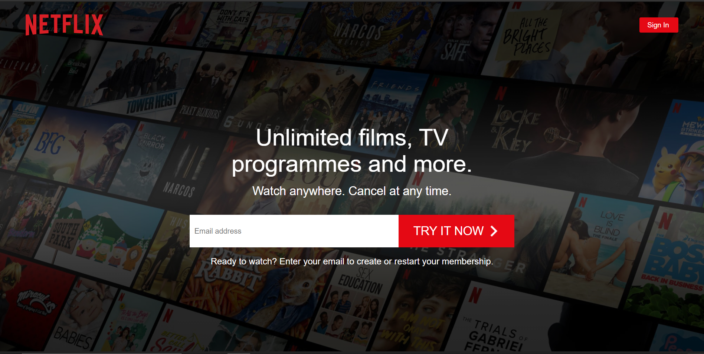

# Netflix Clone

This application (a Netflix clone) was built using React (Custom Hooks, Context), Firebase & Styled Components. I have built the following pages within this application: sign in, sign up, browse & lastly the homepage. There are four different pages, some using protected routes with auth listeners. Firebase firestore handles all the data and that data is retrieved using a custom hook; authentication is used on all pages, which is handled by Firebase as well.

## 🔗 Links

[Deployed App](https://netflix-clone-webapp.netlify.app/)

[Github Repo](https://github.com/chandpratik/netflix-clone)

## Screenshots



## Tech Stack

**Client:** React, Styled Components.

**Backend:** Firebase.

## Run Locally

Clone the project

```bash
  git clone https://github.com/chandpratik/netflix-clone.git
```

Go to the project directory

```bash
  cd netflix-clone
```

Install dependencies

```bash
  npm install
```

Start the server

```bash
  npm run start
```
